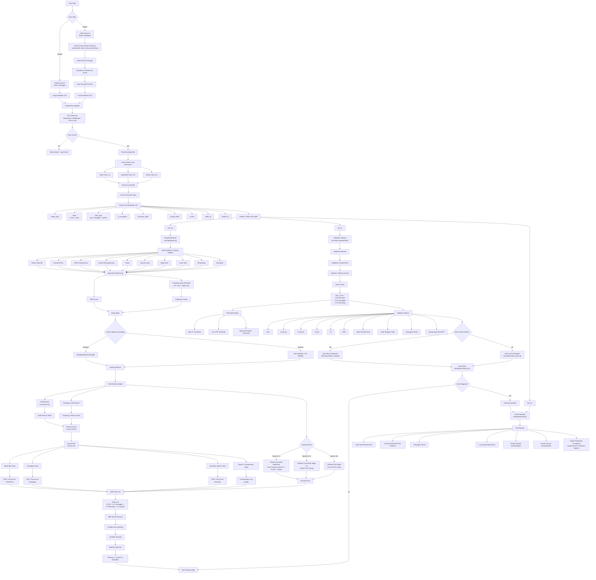

# InSwapper Detector: Open-Source Deepfake Face Swap Detection Pipeline

> 🚧 This project is currently under active development.
> APIs, architecture, and training pipeline may change frequently.


Open-source deepfake detection pipeline for detecting InSwapper face swaps, AI-generated face manipulation, forged face videos, and face-swap artifacts using ConvNeXt-Tiny, frequency features, scene-aware video sampling, and FastAPI inference.

## Layout

- `app/`: FastAPI app, routes, settings, request/response schemas.
- `core/`: pure model, preprocessing, inference, postprocessing logic.
- `training/`: offline training and evaluation only.
- `data/`: CSV manifests only; raw images stay out of git.
- `configs/`: YAML training configs.
- `scripts/`: preprocessing, splitting, and video-frame manifest utilities.

## Setup

Use Python 3.12 for the training/serving container. Very new Python versions may not have wheels for `insightface`, `onnxruntime`, or other ML packages yet.

```bash
uv sync --extra train --extra test
cp .env.example .env
```

Pip fallback:

```bash
python3.12 -m venv .venv
source .venv/bin/activate
pip install -r requirements-train.txt
```

## Data

Create `data/train.csv`, `data/val.csv`, and `data/test.csv` with:

```csv
path,label,source
data/raw/real/0001.jpg,0,celebdf
data/raw/fake/0001.jpg,1,inswapper
```

Split by identity/source video to avoid leakage.

For the current local dataset layout, build the video manifest automatically:

```bash
uv run python scripts/build_video_manifest.py \
  --data-root data \
  --output-csv data/video_manifest.csv
```

This reads:

- `data/inswapper/original_videos` as real
- `data/inswapper/inswapper` as fake INSwapper
- `data/inswapper/uniface` as fake UniFace manipulated videos

Other original-video sources are intentionally excluded so the detector learns manipulation artifacts from the same source distribution instead of unrelated dataset differences. Training balance is handled by the sampler, not by dropping fake samples from the manifest.

## Train

For image datasets, create a raw manifest such as `data/raw_manifest.csv`.

For video datasets, first convert videos into scene-aware training frames and write the same raw manifest format:

```bash
python scripts/build_video_frame_manifest.py \
  --videos data/video_manifest.csv \
  --output-csv data/raw_manifest.csv \
  --output-dir data/raw/video_train_frames \
  --frames-per-scene 6
```

Create face crops and final metadata:

```bash
python scripts/build_processed_crop_manifest.py \
  --input-csv data/raw_manifest.csv \
  --output-csv data/processed_metadata.csv \
  --output-dir data/raw/processed_crops
```

Split safely by identity/video group:

```bash
python scripts/split_metadata.py \
  --metadata data/processed_metadata.csv \
  --train data/train.csv \
  --val data/val.csv \
  --test data/test.csv
```

For faster training on large datasets, pack each split into Zarr:

```bash
python scripts/build_zarr_dataset.py \
  --metadata data/train.csv \
  --output data/zarr/train.zarr \
  --root-dir . \
  --overwrite

python scripts/build_zarr_dataset.py \
  --metadata data/val.csv \
  --output data/zarr/val.zarr \
  --root-dir . \
  --overwrite

python scripts/build_zarr_dataset.py \
  --metadata data/test.csv \
  --output data/zarr/test.zarr \
  --root-dir . \
  --overwrite
```

To train from Zarr, set the config manifests to the `.zarr` directories:

```yaml
data:
  root_dir: .
  train_manifest: data/zarr/train.zarr
  val_manifest: data/zarr/val.zarr
  test_manifest: data/zarr/test.zarr
```

Then train the final ConvNeXt-Tiny multi-task detector:

```bash
python training/train.py --config configs/convnext_tiny.yaml
```

The best checkpoint is written to `checkpoints/best_model.pt`.
Training history is written to `checkpoints/history.csv`.

Final ConvNeXt-Tiny training recipe:

- production face detection with InsightFace before crop generation and inference
- pretrained `convnext_tiny` backbone from `timm`
- RGB branch plus frequency CNN branch
- optional Zarr-backed dataset loading for high-throughput training
- multi-task heads for real/fake, InSwapper, boundary artifacts, and quality/compression
- weighted multi-task loss with automatic class-balance alpha
- balanced sampler for real/fake imbalance
- phased fine-tuning: frozen backbone, last-stage unfreeze, full-model unfreeze
- AdamW with warmup plus cosine decay
- mixed precision, gradient clipping, optional gradient accumulation
- checkpoint selection by product metric
- score fusion and validation threshold sweep

## Final Training Pipeline

This is the training pipeline the project follows for production model development.



## Evaluate

```bash
python training/evaluate.py --config configs/convnext_tiny.yaml --checkpoint checkpoints/best_model.pt
```

## Serve

```bash
uvicorn app.main:app --reload
```

Endpoints:

- `GET /health`
- `GET /ready`
- `POST /detect`
- `POST /detect/batch`
- `POST /detect/video`
- `POST /admin/reload-model`
- `POST /admin/threshold`

Example:

```bash
curl -F "file=@face.jpg" http://localhost:8000/detect
```

Local inference without the API:

```bash
python scripts/predict_video.py clip.mp4 --checkpoint checkpoints/best_model.pt
```

## Scene-Aware Video Detection

The model still predicts one frame at a time with ConvNeXt-Tiny. For videos, the pipeline:

1. Scans the video using HSV histogram distance to find scene cuts.
2. Samples up to 6 evenly spaced frames inside each detected scene.
3. Runs the image detector on every sampled frame.
4. Averages frame fake probabilities into one video-level result.

This avoids wasting all samples on near-duplicate frames from one shot and gives you frame-level evidence for review.

## Production Notes

- Put the trained checkpoint at `checkpoints/best_model.pt` or set `INSWAPPER_MODEL_PATH`.
- Tune `INSWAPPER_THRESHOLD` from validation metrics, not from the test set.
- Default face detection is `INSWAPPER_FACE_DETECTOR=insightface`. Use `opencv_haar` only for local development experiments.


topics:?
Deepfake detection, InSwapper detector, face swap detection, AI-generated face detection, forged video detection, ConvNeXt deepfake model, deepfake artifact detection, face manipulation detection, FastAPI deepfake API, PyTorch deepfake detector